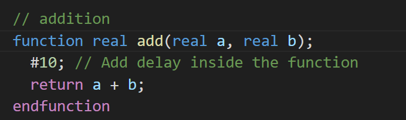
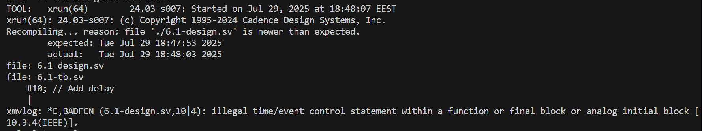
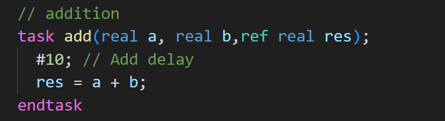
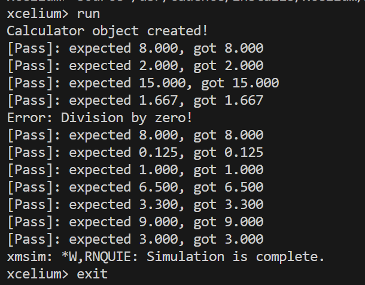

# Time Consuming Elements in Functions vs Tasks

## Experiment 1: Timing Components in Functions

### Code:

### Error:

### Explanation

- The code gives the error: `illegal time/event control statement within a function`
- SystemVerilog functions are designed to execute in **zero simulation time**.
- So, Time control statements like `#delay`, `@(event)`,`fork-join` or `wait()` are **not allowed** in functions
- Functions are considered as **combinational logic** that produces immediate results

---

## Experiment 2: Timing Components in Tasks

### Code :

### Result:

### Explanation

- **No compilation errors**
- Tasks can **consume simulation time**, unlike functions that execute in **zero simulation time**.
- Tasks can contain **any timing controls** , `#delay`, `@(event)`, `wait()`,`fork-join`, etc.

---